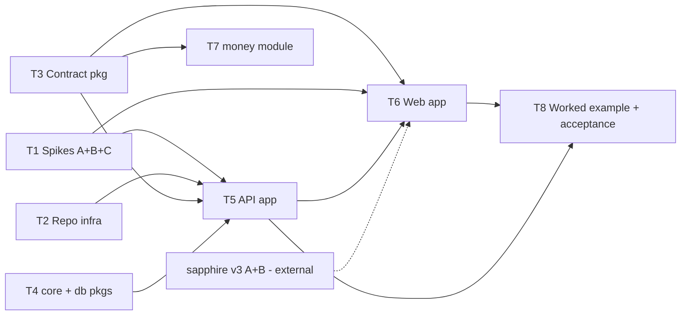

# kongmy-stack — Parallel Execution Plan

> Operational companion to `PLAN.md` (strategy) and `TASKS.md` (full checklist). This file is what you kick threads off from: layout freeze → waves → per-thread briefs with **disjoint file ownership** so parallel agent threads never conflict.

## Ground rules for every thread

- Read `CLAUDE.md` + the ADRs your brief lists **before writing code**. ADRs are law; friction → note in your outcome report, don't fork conventions.
- **Stay inside your owned paths** (listed per thread). Needing to touch another thread's path = a dependency you missed — stop and flag.
- Work on branch `ws/<thread-id>`; rebase on main before PR; merges happen at wave boundaries. Small commits, `bun run ci` green (once T2 lands it; before that, typecheck at minimum).
- Record outcomes: spikes write `docs/adr/0011+`; build threads tick `TASKS.md` and note deltas at the bottom of this file.

## Layout (FROZEN — place files here, no debate)

```
skeleton/                    # the clone-point (what a new project starts as)
  apps/api/                  # Hono app factory, routes, errorHandler, authz, audit, otel, client-gen
  apps/web/                  # Vite + TanStack Router/Query SPA, features/, vendored ui
  packages/contract/         # zod SSOT: scalars, helpers, pagination, error codes (+ CI check scripts)
  packages/core/             # pure domain placeholder + AppError classes (no I/O)
  packages/db/               # drizzle, withScope, adapters (pg|pglite|in-memory), conventions
  deploy/                    # systemd unit, Dockerfile, workers config
  .github/workflows/ci.yml   # bun run ci
  biome.json · tsconfig.base.json · .dependency-cruiser.cjs · package.json (workspaces)
  CLAUDE.md.template         # scaffolded-project agent docs (ADR-0005)
modules/                     # money/ queue/ events/ agentic/ ledger/ connector/ country-my/
spikes/                      # a-pgboss-pglite/ b-zod-openapi/ c-i18n-catalog/  (throwaway code, kept for reference)
scripts/add.ts               # module copier
docs/adr/                    # 0001–0010 law + 0011+ spike outcomes
```

## Waves & dependency graph



**Wave 1 (kick off all four NOW, fully parallel):** T1, T2, T3, T4
**Wave 2 (after T1+T3+T4 merge):** T5 · (T7 may start once T3 merges)
**Wave 3 (after T5; sapphire interim fallback allowed):** T6
**Wave 4 (integration):** T8 — then emas-pos scaffolds (its own repo/brief: `~/Projects/emas-pos/STACK-MIGRATION.md`)

---

## Thread briefs

### T1 — Spikes (wave 1)
**Owns:** `spikes/**`, `docs/adr/0011..0013` (new files only)
**ADRs:** 0007, 0009 (context); outcomes become 0011 (API adapter), 0012 (queue×PGlite), 0013 (i18n lib)
**Do:** ① pg-boss against PGlite: enqueue/work/retry/dead-letter — pass ⇒ PGlite lane uses pg-boss (kill SQL-fallback plan); fail ⇒ spec minimal SQL fallback (jobs table + SKIP LOCKED + backoff). ② `@hono/zod-openapi` × zod v4 on 3 representative routes (list+pagination, create+validation, get+errors) vs fallback `hono-openapi` — pick one. ③ Paraglide vs i18next: typed keys, bundle cost, Vite/TanStack fit, plural/ICU — pick one.
**Done when:** three ADRs written with a clear pick + evidence; spike code runs via `bun`.

### T2 — Repo & skeleton infra (wave 1)
**Owns:** `skeleton/` root files (package.json workspaces, biome.json, tsconfig.base.json, .dependency-cruiser.cjs, .github/, CLAUDE.md.template), `skeleton/deploy/**`, `scripts/add.ts`
**ADRs:** 0001 (allowed-imports table → dep-cruiser rules), 0003, 0005
**Do:** bun workspaces wiring · Biome config · dep-cruiser encoding the ADR-0001 table (rules reference paths that may not exist yet — fine) · `bun run ci` = typecheck + boundaries + tests · GH Actions workflow · systemd unit + Dockerfile + workers config templates · scaffolded-project CLAUDE.md template · `scripts/add.ts` module copier (copy + workspace patch).
**Done when:** `bun install && bun run ci` green on the skeleton with stub packages; dep-cruiser fails a deliberate violation test.

### T3 — Contract package (wave 1)
**Owns:** `skeleton/packages/contract/**`
**ADRs:** 0004 (all), 0009 (all), 0008 (permission derivation hooks)
**Do:** scalars.ts full day-1 set (Money, CurrencyCode, ExchangeRate, Quantity+UoM, bps rates, TaxCode, DateOnly/DateTime, Timezone, DocumentNumber format, Phone, Email, Address, FileRef, AuditStamp, id('prefix') branded ULIDs, withVersion) · paginationQuery + listResponse · error codes enum · `resource()` / `action()` helpers emitting route metadata + derived permission ids + MCP tool descriptors (transport-agnostic — NO hono/adapter imports, contracts import only zod) · document-lifecycle declaration helper · CI scripts: describe-coverage + no-any.
**Done when:** an example resource contract compiles, derives permissions, passes both CI checks; zero non-zod imports (dep-cruiser will verify later).

### T4 — core + db packages (wave 1)
**Owns:** `skeleton/packages/core/**`, `skeleton/packages/db/**`
**ADRs:** 0003, 0005 (DB conventions), 0008 (roles/memberships tables), 0009 (sequences), 0010 (audit table)
**Do:** core: AppError subclass set + pure-domain placeholder (zero I/O). db: drizzle setup + adapter seam (pg | pglite | in-memory) · `withScope(org, branch)` · conventions (prefixed-ULID pk helper, createdAt/updatedAt in repo layer) · `roles`/`memberships` tables · `audit_log` table · DocumentNumber sequence table + gapless/fast helpers · drizzle-kit migrate flow + idempotent seed scripts · example schema + repo functions.
**Done when:** contract tests run against the in-memory adapter; a scope-violation test fails correctly; sequence helper proves gapless under concurrent inserts (test).

### T5 — API app (wave 2; needs T1-B pick, T2, T3, T4)
**Owns:** `skeleton/apps/api/**`
**ADRs:** 0004, 0005, 0008, 0010
**Do:** pure `createApp(deps)` factory · OpenAPI adapter wiring (per ADR-0011 pick) over contract route metadata · ONE errorHandler (envelope + AppError map + request-id echo) · `registerResource()` CRUD wiring · ctx construction (two-level, ADR-0003) · `ctx.authz` (session permission set, can/assert, owner predicate) enforced at command door · audit write at door · env fail-fast schema · request-id + traceparent + request span + RED middleware (OTel API seam, OTLP by env) · `/health` + graceful shutdown · client generation script (OpenAPI → typed TS client) · one worked resource end-to-end · contract-test harness pattern (`app.request()` + in-memory adapters + zod factories).
**Done when:** worked resource passes contract tests incl. 422/401/403/404 envelope shapes; generated client typechecks; audit rows + trace ids observable in tests.

### T6 — Web app (wave 3; needs T3, T5 client, T1-C pick; sapphire external)
**Owns:** `skeleton/apps/web/**`
**ADRs:** 0004 (error→UI), 0007, frontend locks in vault note §Frontend
**Do:** Vite + React + TanStack Router (file-based) + Query providers · vendored UI: sapphire registry if v3 Phase A/B live, else plain shadcn + `@import` sapphire theme.css (swap later) · the 8 seams: generated-client wrapper, queryOptions factories, DataTable↔pagination (state in URL search params), zodResolver forms, search-param validation from contract, ApiError→form.setError/toast, session hook + beforeLoad guards · i18n plumbing per ADR-0013 pick (locale ctx user→tenant→en, Intl helpers, error-code rendering, ALL strings through t()) · `features/` structure.
**Done when:** worked feature (list+create/edit+delete) runs end-to-end against T5's api; URL is shareable state; a forced 422 lands on the right form field; zero hardcoded strings.

### T7 — money module (wave 2+, needs T3; emas-pos pull)
**Owns:** `modules/money/**`
**ADRs:** 0009; source: `~/Projects/emas-pos/packages/pos-kernel` Money/Weight VOs (generalize, decimal.js internal, minor-units wire)
**Do:** VOs + arithmetic (allocation/rounding rules explicit) + fast-check property tests + zod codec to/from contract scalars.
**Done when:** property tests pass (associativity of allocation, no lost cents); emas-pos thread confirms the API fits its pricing kernel.

### T8 — Integration & acceptance (wave 4)
**Owns:** cross-cutting fixes only via the owning thread's paths; `EXECUTION.md` outcome notes
**Do:** run PLAN.md acceptance list: fresh `bun create` → running CRUD in <1h with zero platform code · full `bun run ci` · zero hand-written fetch / unvalidated routes · spikes ADR'd · hand emas-pos its scaffold signal.

---

## External coordination

- **sapphire v3** (Kong My kicks off separately): T6 needs Phase A+B for real vendoring; interim fallback is sanctioned — do not block.
- **emas-pos**: scaffolds after T8; its platform packages migrate into `modules/` per its brief — money (T7) first.

## Outcome notes (threads append here)

- **2026-07-14 · T1 complete** (3 spikes + hardening round). Picks: `@hono/zod-openapi` (ADR-0011) · **pg-boss on ALL PG lanes** incl. PGlite via first-party `fromPglite()`, minimal-SQL fallback dead (ADR-0012) · Paraglide JS, real-app-proven (ADR-0013). Consolidated archive w/ snippets: `docs/spikes/`. Queue conformance suite (3 lanes × 6 assertions, green) seeds `modules/queue` contract tests. **Sapphire v3 registry live + true-CLI smoke green against production** → T6 vendors for real; interim shadcn fallback no longer needed.
- **Process delta:** round-1 agents leaked commits onto `main` by cd-ing to the repo root (reset to 546f2ce; content preserved on branches). Thread briefs now pin cwd=worktree with a `git rev-parse --show-toplevel` guard; `.claude/` gitignored. Round 2 stayed clean.
- **Stub-manifest rule (T2 vs T3/T4):** T2 may create *stub* `package.json` + placeholder `src/index.ts` in `skeleton/packages/*` / `skeleton/apps/*` so `bun run ci` has something to chew; owning threads' versions supersede at wave-boundary merge (path-based checkout, no textual conflicts).
